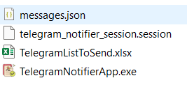

# Trivia Game
Игра "Сила Мысли" - это игра-викторина, которая запускаеться в фйле PowerPoint *.ppm,
Шоу должен запущено с МАКРО (скоро будет добавлен) который в вовремя игры
доолжен будет собирать информацию с текущего слайда и сохранять это в ТЕКСТ файле.
Сообщать - номер этого слайда и текст всех 'Заголовоков/'Titles' и счётчик, где это будет.
`AppGame.py` - будет отслеживать этот следующий техт файл (скоро будет добавлен) для взаимодействие с игроками.  
Игрок (предстовитель команды) долженен будет ответить на вопросы за определённое время.
Игра делиться на туры связанные с различными темами и время на ответ в турах может быть разным.
(еть туры где доёться дополнительная минута проверить ответы, где ответ ещё может быть изменён)
В некоторых турах могут ответы подоваться с бонусом.  
Игра может быть использована в качестве развлекательного мероприятия, например, на вечеринке или корпоративе.
Также имеиться `TelegramNotifierApp.py` который может быть использован ведущим для  сообщения результатов туров командам.

# Requirements
Must be run with Python 3.9 or higher the packages installed in the `requirements.txt` file. If using:
 - the `AppGame.py` file
 - the `GameServerPlacesUpdater.py` file
 - the `TelegramNotifierApp.py` file (Create your own an application https://core.telegram.org/api/.
to get the *api_id* and *api_hash* credential to use the APP for the messages sending
(add them to your ENV as TELEGRAM_API_ID and TELEGRAM_API_HASH accordingly or provide them as input).
During the first message sending should be created ```telegram_notifier_session.session```
 - Existing EXE files of the APP compiled with all the environment to use on Windows 10/11

# Installation to run the Python scripts/apps

```bash
pip install -r requirements.txt
```
# Run the game with EXE files of the `TelegramNotifierApp` or `AppGame` or `GameServerPlacesUpdater`:
Download the latest release and create the following/required files:
- `TelegramNotifierApp.exe` must be used with `telegram_notifier_session.session`
and (as an option) for adding a new messages `messages.json` (both must be located in the same folder as the EXE file)
See the Excel file format/example to send messages: `TelegramListToSend.xlsx`
(check the description Tab/Sheet for more details).


- `GameServerPlacesUpdater.exe` - the EXE file that will update the game places in the PowerPoint file
based on the `results.xlsx` file and the `places.json` file setting.
The Excel file should be received and saved in the same place as is the EXE file.
The JSON file setting used to define the places' names and some rules about the setup the middle and last places.
(check for more details the 'description Tab/Sheet' in Excel and the '_comment_' in JSON).
- `config.py` - the configuration file with the parameters for the game
- `questions.json` - the file with the questions and answer for the game
- `teams.json` - the file with the team list allow playing in the game#


# Details related to the Telegram notifier `TelegramNotifierApp.py` file
Here is a Python script that will load parameters from an external file 
(if it exists, and otherwise will use default parameters defined inside the main script)
- `TelegramNotifierApp.exe` must be used with `telegram_notifier_session.session`
and (as an option) for adding a new messages `messages.json` (both must be located in the same folder as the EXE file)
- See the Excel file format/example to send messages: `TelegramListToSend.xlsx`


# Usage
When you created AppAPI in Telegram and know the *api_id* and *api_hash*.
For one of the teams exists in both Sheets (1&2) in the `TelegramListToSend.xlsx` file 
add the phone-number one of your contacts.
Open the APP enter the *api_id* and *api_hash* and load this xlsx file,
then press on the "Send Notification" button.
Check the console and answer to the questions asked the Telegram the first time
during the `telegram_notifier_session.session` file generation

# Details related to the game Application `AppGame.py` file
Here is a Python script that will load parameters from an external file
(if it exists, and otherwise will use default parameters defined inside the main script)
- SOON

# Usage
SOON

# DEV part
The new requirements.txt file creation:

Attention! This will overwrite the existing "requirements.txt" file.
To silence this warning use ```--strip-extras``` to opt into the new default
or use ```--no-strip-extras``` to retain the existing behavior

```bash
pip install pip-tools
pip-compile requirements.in
```
# The new requirements.in file creation
Collect the main packages used in the project.
It will not include the dependencies of the packages and print them to the console.
Copy the output to the "requirements.in"
```bash
pip install pipdeptree
pipdeptree --warn silence --freeze | findstr /R "^[a-zA-Z0-9]"
```

# The new "requirements.txt" file creation (simple way)
It will include all the pakages with dependencies of the packages as well.
```bash
pip freeze > requirements.txt
```

